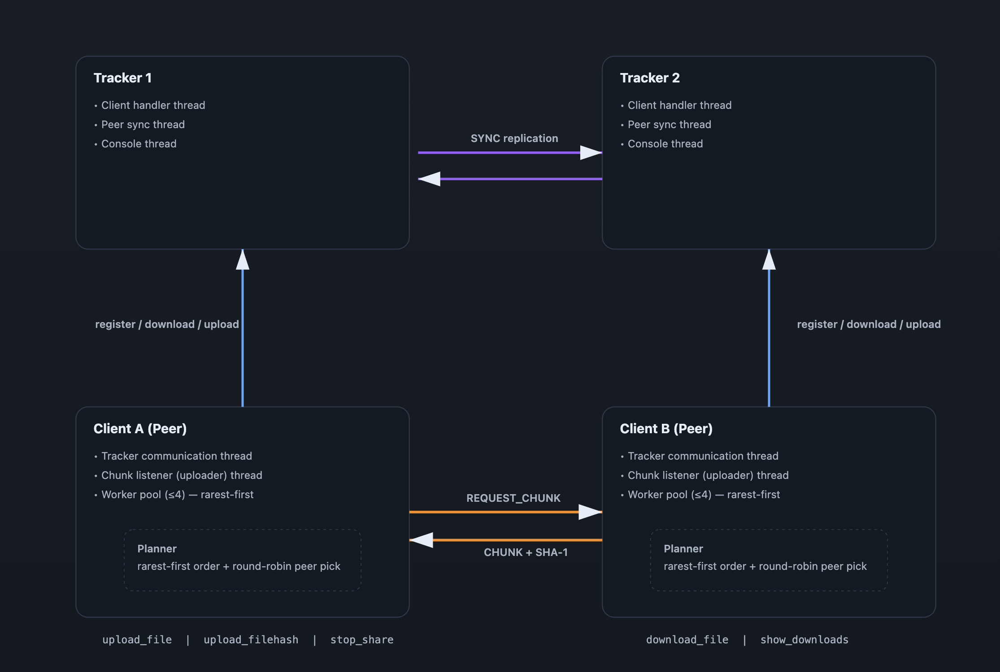

# Secure Peer-to-Peer Distributed File Sharing System

A robust, highly secure distributed peer-to-peer (P2P) file sharing system built in C++ featuring dual-tracker redundancy, chunked parallel downloads, rarest-first scheduling, and advanced cryptographic security protocols including SSL/TLS channels, zero-knowledge RSA Challenge-Response authentication, digital signatures, group-key management, and symmetric AES-256 chunk-level encryption.

Repository: [https://github.com/Rama-Vaibhav/PEER-To-PEER-FILE-Sharing-System.git](https://github.com/Rama-Vaibhav/PEER-To-PEER-FILE-Sharing-System.git)

---

## 🏛️ Architecture



The system consists of two primary components:

* **Tracker** — A centralized metadata server that manages users, groups, and file-to-peer mappings. Two trackers run simultaneously for fault tolerance, synchronizing state via SYNC messages. Both trackers enforce network-level SSL/TLS and security features like brute-force lockout protection.
* **Client** — A peer node that communicates with the tracker for metadata and directly with other peers for file transfers. Each client runs two threads: one for tracker communication and one as a peer server to serve file chunks to other peers. All peer-to-peer chunk transfers are wrapped in TLS and encrypted at the chunk level using AES-256.

---

## 🔒 Security Architecture Highlights

To ensure end-to-end privacy, authenticity, and authorization, this system incorporates several cutting-edge cryptographic features:
* **TLS Channel Encryption:** All connections (client-to-tracker, tracker-to-tracker, and peer-to-peer) are wrapped using OpenSSL TLS.
* **Challenge-Response Login:** User logins utilize a zero-knowledge RSA digital signature verification scheme. Plaintext passwords or hashes are never transmitted over the wire.
* **Login Lockout Protection:** The tracker enforces account lockouts after 5 consecutive failed login attempts to prevent brute-forcing.
* **Digital Signatures on Uploads:** Uploaded file hashes are signed with the uploader's private RSA key, guaranteeing authenticity and preventing tampering.
* **AES Chunk-Level Symmetric Encryption:** High-speed, secure file chunks are encrypted on-the-fly using AES-256-CBC.
* **Access Control & Group Key Management:** Secure distribution of group-keys encrypted using users' public keys, maintaining end-to-end confidentiality.

For complete, detailed descriptions of algorithms and code paths, refer to the [security.md](security.md) specification file.

---

## 📂 Project Structure

```text
client/
  peer.cpp                  # Client main entry point
  client.h                  # Client header with shared declarations
  handleCommands.cpp        # Command parsing, RSA keys, and Challenge-Response login
  connectionWithTracker.cpp # Tracker connection with dual-tracker failover over TLS
  downloadFileFromPeer.cpp  # Parallel chunked download engine & signature verifier
  peerDownloadHelpers.cpp   # Peer-to-peer download helpers & AES decryption
  peerUploadHelpers.cpp     # Peer-to-peer upload helpers & AES encryption
  fileStorage.cpp           # Local file path registry
  shaUtil.cpp               # SHA-1 hash utilities (per-chunk and full-file)
  tlsUtil.cpp               # OpenSSL TLS connection wrapping helper
  makefile                  # Builds the `client` binary

tracker/
  tracker.cpp               # Tracker main entry point
  tracker.h                 # Tracker header with shared data structures
  handleClientCommands.cpp  # Command dispatcher, brute force protection, public keys
  handleDownload.cpp        # Download request handler & digital signature distributor
  trackerConnection.cpp     # Peer-tracker sync connection management over TLS
  trackerData.cpp           # Global data structure definitions
  passwordUtil.cpp          # Password hashing and salt helpers
  tlsUtil.cpp               # OpenSSL TLS context wrapping helper
  makefile                  # Builds the `tracker` binary

common/
  cryptoUtil.cpp / .h       # Global RSA key generation, AES enc/dec, and signature helpers

certs/
  server.crt / server.key   # TLS Certificate authority certificates for network security
  ca.crt / ca.key           # Certificate authority credentials
  generate_certs.sh         # Helper shell script to generate/renew TLS keys
```

---

## ⚙️ Getting Started

### Prerequisites
* **C++17** compatible compiler (`g++` / `clang++`)
* **OpenSSL 3.x** — install via Homebrew on macOS:
  ```bash
  brew install openssl@3
  ```
* **POSIX** system (Linux / macOS)

### 1. Configure trackers (`tracker_info.txt`)
Both the tracker and client directories must contain a `tracker_info.txt` file listing the IP addresses and ports of the trackers:
```text
127.0.0.1
8001
127.0.0.1
9001
```

### 2. Starting the Trackers
Start the dual trackers using their respective IDs:
```bash
# Terminal 1 — Tracker 1
cd tracker
make clean && make
./tracker tracker_info.txt 1

# Terminal 2 — Tracker 2
cd tracker
make clean && make
./tracker tracker_info.txt 2
```

### 3. Starting the Clients (Peers)
Launch multiple client instances on separate terminal sessions. Specify the client's listening socket as the first parameter:
```bash
# Terminal 3 — Client 1
cd client
make clean && make
./client 127.0.0.1:9000 tracker_info.txt

# Terminal 4 — Client 2
cd client
make clean && make
./client 127.0.0.1:9002 tracker_info.txt
```

---

## 💻 Supported Commands

The interactive shell accepts the following command syntax (space-separated):

| Command | Description |
|---|---|
| `create user <user_id> <password>` | Register a user (generates & stores user RSA key pair locally) |
| `login <user_id> <password>` | Perform zero-knowledge challenge-response login over TLS |
| `create group <group_id>` | Create a group (generates group key and uploads encrypted format) |
| `join group <group_id>` | Request entry into a group |
| `leave group <group_id>` | Leave a sharing group |
| `list groups` | List all available sharing groups |
| `list requests <group_id>` | List pending requests (group owner only) |
| `accept request <group_id> <user_id>` | Accept request and re-encrypt group key for the new member |
| `upload file <group_id> <file_path>` | Sign & upload a file metadata registry to the group |
| `list files <group_id>` | List all files shared inside a group |
| `download file <group_id> <file_name> <dest_path>` | Decrypt & download file in parallel from peers, verify signature |
| `show downloads` | Show current download progress and status |
| `stop share <group_id> <file_name>` | Stop sharing file contents |
| `logout` | Log out from tracker (resets session, stops serving files) |

### Example Usage Flow

```bash
>> create user alice pass123
# (Creates local RSA keys: alice_private.pem / alice_public.pem)
>> login alice pass123
# (Completes challenge-response protocol over TLS; login successful)
>> create group g1
# (Generates 256-bit AES key for g1, encrypts it with alice's public key, uploads it)
>> upload file g1 /path/to/myfile.mp4
# (Signs file checksum with alice's private key, registers with tracker)

# On another client (bob):
>> create user bob pass456
>> login bob pass456
>> join group g1

# Back on alice's client:
>> list requests g1
>> accept request g1 bob
# (Alice's client fetches bob's public key, decrypts g1's group key, encrypts it with bob's public key, uploads it)

# On bob's client:
>> download file g1 myfile.mp4 /path/to/destination/myfile.mp4
# (Bob's client fetches his encrypted group key, decrypts it locally, downloads AES-encrypted chunks from Alice, decrypts them, and verifies Alice's digital signature)
>> show downloads
```

---

## 🛠️ Detailed Edge Cases Handled

### 1. `create user <user_id> <password>`
* **Existing Users:** If the `user_id` already exists, returns `"User already exists"`.
* **Registration Success:** Hashes the password with SHA-256 + random salt (for backup tracker database verification), generates a 2048-bit RSA key pair, saves keys locally as `<user_id>_private.pem` and `<user_id>_public.pem`, and sends the public key to the tracker.

### 2. `login <user_id> <password>`
* **Active Session Check:** If the current client terminal session already has a logged-in user, returns `"You are already logged in as ... Please logout first"`.
* **Nonexistent User:** If the user does not exist on the tracker, returns `"User does not exist"`.
* **Account Lockout:** Enforces brute-force lockout. If 5 consecutive failed logins occur, locks the account for **5 minutes** and returns `"Account locked due to brute force protection"`.
* **Zero-Knowledge Challenge-Response:** 
  1. Client sends `login_challenge <user_id>`.
  2. Tracker generates a cryptographically secure 32-byte challenge (`RAND_bytes`), saves it to the socket context, and sends it to the client.
  3. Client signs this challenge using `<user_id>_private.pem` and returns the signature.
  4. Tracker verifies the signature using the stored public key. If verification succeeds, login is approved and the lockout counter is reset.

### 3. `create group <group_id>`
* **Authentication Check:** Returns `"You must be logged in to create a group"` if called anonymously.
* **Duplication Guard:** Returns `"Group already exists"` if a group with the same name exists.
* **Key Provisioning:** Generates a random 256-bit AES Group Key, encrypts it using the creator's RSA public key, and sends it to the tracker for storage.

### 4. `list groups`
* **Authorization Check:** Must be logged in.
* **No Groups:** Returns `"No groups available"` if the global registry is empty.
* **Format:** Outputs a list of all active group IDs.

### 5. `join group <group_id>`
* **Authorization Check:** Must be logged in.
* **Validity Check:** Returns `"Group does not exist"` if the group doesn't exist.
* **Duplication Checks:** Returns `"You are already a member"` or `"You already requested to join group"` as appropriate.
* **Success:** Places the user on the group's pending join requests list.

### 6. `leave group <group_id>`
* **Validity Checks:** Validates user login, group existence, and membership.
* **Ownership Succession:** If the leaving user is the group owner:
  * If other members exist, ownership transfers automatically to the first remaining member.
  * If the owner is the last remaining member, the group is deleted.

### 7. `list requests <group_id>`
* **Ownership Restriction:** Returns `"Only the owner of group ... can view join requests"` if the calling user is not the group owner.
* **Format:** Outputs all usernames currently pending approval.

### 8. `accept request <group_id> <user_id>`
* **Ownership Restriction:** Only the owner can accept requests.
* **Key Distribution:** 
  1. Owner's client queries the tracker for the candidate's RSA public key and the encrypted group key.
  2. Owner's client decrypts the group key using the owner's private key.
  3. Owner's client encrypts the group key using the candidate's public key.
  4. Sends the re-encrypted group key to the tracker alongside the acceptance command.

### 9. `upload file <group_id> <file_path>`
* **Permissions Check:** Validates that the user is a logged-in member of the specified group.
* **Integrity and Signatures:** Client calculates the SHA-1 hash of the file. Using `<user_id>_private.pem`, it signs the file hash. The signature and uploader's public key are uploaded to the tracker.

### 10. `list files <group_id>`
* **Permissions Check:** Only members of the group can view files.
* **Format:** Lists all files, their sizes, chunk counts, and hashes.

### 11. `download file <group_id> <file_name> <dest_path>`
* **Access Validation:** Checks group membership.
* **Decryption setup:** Client queries the tracker for its user-specific encrypted group key, decrypting it using its private key.
* **Parallel Fetching:** Fetches chunks in parallel from active seeders. Each chunk is encrypted using AES-256-CBC, and decrypted on-the-fly.
* **Digital Signature Check:** Once assembly completes, the client calculates the file's SHA-1 checksum and verifies it against the uploader's digital signature. If verification fails, the download is marked failed and discarded.

### 12. `show downloads`
* **Format:** Displays current downloads with status tags: `[C]` Completed, `[I]` In-progress, `[F]` Failed.

### 13. `stop share <group_id> <file_name>`
* **Success:** Removes the client from the seeders list for that file on the tracker.

### 14. `logout`
* **Session cleanup:** Clears the client's active session, resets the logged-in state, and removes the peer from the active seeders list so stale ip/ports are not returned to downloaders.

---

## 🛠️ Design Details

### Global Data Structures (Tracker)

| Data Structure | Type | Purpose |
|---|---|---|
| `usersInfo` | `unordered_map<string, User>` | maps `user_id` to credentials, login states, salts, and public keys |
| `groupOwners` | `unordered_map<string, string>` | maps `group_id` to owner username |
| `groupMembers` | `unordered_map<string, set<string>>` | maps `group_id` to set of member usernames |
| `groupJoinRequests` | `unordered_map<string, set<string>>` | maps `group_id` to set of pending usernames |
| `activeSessions` | `unordered_map<int, string>` | maps socket FD to active username |
| `fileTable` | `unordered_map<string, unordered_map<string, FileInfo>>` | maps `group_id` -> `file_name` -> `FileInfo` |
| `groupKeys` | `unordered_map<string, unordered_map<string, string>>` | maps `group_id` -> `user_id` -> encrypted AES Group Key |

All global structures are guarded by dedicated `std::mutex` instances to ensure absolute thread-safety.

### FileInfo Structure
```cpp
struct FileInfo {
    std::string fileName;
    size_t fileSize = 0;
    int numChunks = 0;
    std::unordered_map<int, std::set<std::string>> chunkToPeers; // chunkIndex -> set of "ip:port"
    std::unordered_map<std::string, std::set<int>> peerToChunks; // "ip:port" -> set of chunkIndices
    std::string fileShaHex;
    std::string uploaderId;
    std::string signatureHex;
    std::string uploaderPublicKey;
};
```

### Threading Model

| Thread Name | Lifetime | Responsibility |
|---|---|---|
| **Tracker Listener Thread** | Run continuously | Listens on the tracker port for incoming client sockets |
| **Tracker Worker Thread (per client)** | Per socket connection | Reads commands, parses, and executes database mutations over TLS |
| **Tracker Sync Thread** | Run continuously | Keeps trackers synchronized (SYNC messages) |
| **Peer Server Thread** | Client runtime | Listens for chunk requests from other clients, encrypting chunks with AES-256 |
| **Download Worker Pool** | Per file download | Spawns parallel worker threads (up to 4) downloading chunks concurrently |

---

## 📡 Wire Protocol Specifications

### Tracker Request/Response Protocol
* **Challenge Request:**
  `login_challenge <user_id>`  
  Response: `CHALLENGE <32-byte hex nonce>` or `ERROR <message>`
* **Login Signature Response:**
  `login_response <user_id> <signature_hex>`  
  Response: `LOGIN_SUCCESS` or `ERROR <message>`
* **Upload Metadata:**
  `upload_file <group_id> <file_name> <file_size> <sha_hex> <uploader_id> <signature_hex> <uploader_pubkey_hex>`  
  Response: `UPLOAD_SUCCESS` or `ERROR <message>`
* **Download Query:**
  `download_file <group_id> <file_name>`  
  Response:
  ```text
  FILEINFO <fileName> <fileSize> <numChunks> <fileShaHex> <uploaderId> <signatureHex> <uploaderPublicKeyHex>
  PEER <ip> <port> <chunk0>,<chunk1>,...
  PEER <ip> <port> <chunk0>,<chunk1>,...
  END
  ```

### Peer-to-Peer Chunk Protocol
* **Chunk Request:**
  `REQUEST_CHUNK <file_name> <chunk_index>`
* **Chunk Response:**
  ```text
  CHUNK <size_bytes> <hex_iv>\n<raw encrypted binary chunk data>
  ```

---

## 🛠️ Building and Cleanup

To clean and build both target executables:
```bash
# Tracker compilation
cd tracker
make clean && make

# Client compilation
cd client
make clean && make
```
The chunk size is **512 KB**. Files are split, encrypted, transferred, decrypted, and assembled at the destination using `pwrite()` for concurrent, offset-based filesystem writes.